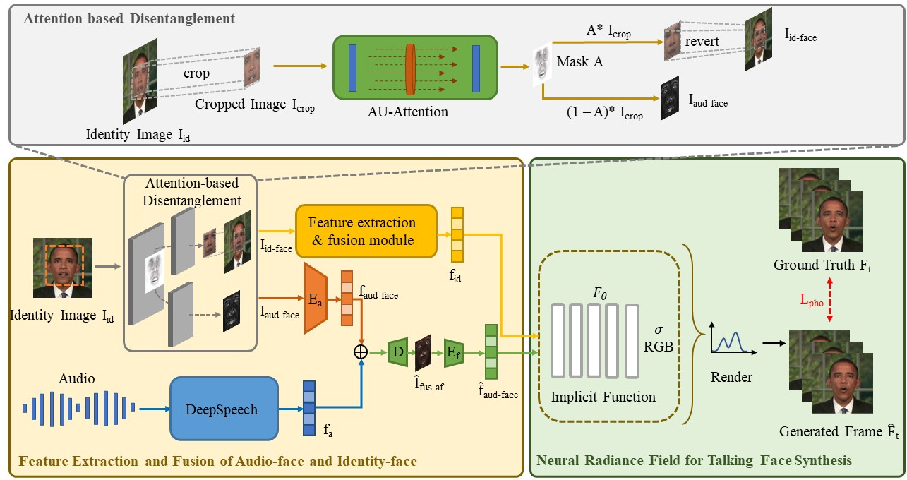
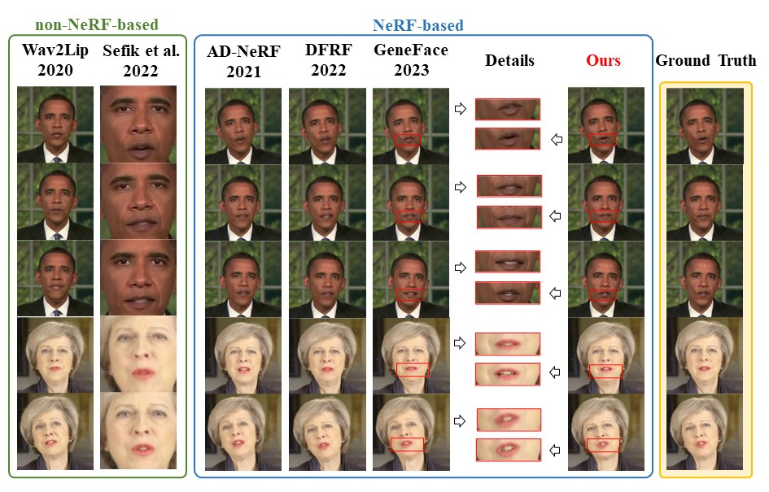
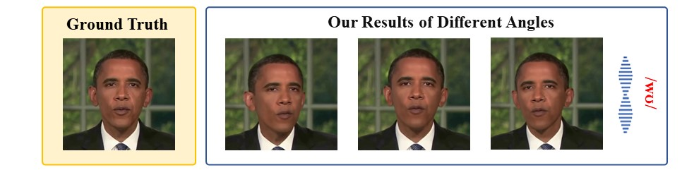
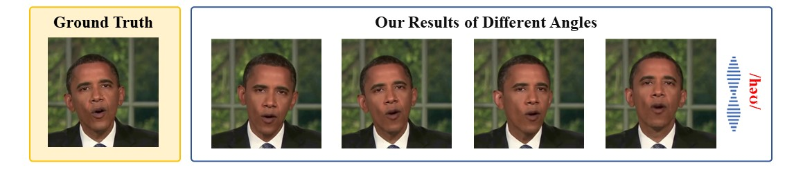

# NeRF-AD: Neural Radiance Field with Attention-based Disentanglement for Talking Face Synthesis

<b>Chongke Bi, Xiaoxing Liu, Zhilei Liu</b>

<b>College of Intelligence and Computing, Tianjin University, Tianjin, China</b>

## Video
---

<video style="width: 100%; height: 100%; margin: 0 auto;" controls>
  <source src="cr.mp4" type="video/mp4">
  Your browser does not support the video tag.
</video>

## Abstract & Method
---

  Talking face synthesis driven by audio is one of the current research hotspots in the fields of multidimensional signal processing and multimedia. Neural Radiance Field (NeRF) has recently been brought to this research field in order to enhance the realism and 3D effect of the generated faces. However, most existing NeRF-based methods either burden NeRF with complex learning tasks while lacking methods for supervised multimodal feature fusion, or cannot precisely map audio to the facial region related to speech movements. These reasons ultimately result in existing methods generating inaccurate lip shapes. This paper moves a portion of NeRF learning tasks ahead and proposes a talking face synthesis method via NeRF with attention-based disentanglement (NeRF-AD). In particular, an Attention-based Disentanglement module is introduced to disentangle the face into Audio-face and Identity-face using speech-related facial action unit (AU) information. To precisely regulate how audio affects the talking face, we only fuse the Audio-face with audio feature. In addition, AU information is also utilized to supervise the fusion of these two modalities. Extensive qualitative and quantitative experiments demonstrate that our NeRF-AD outperforms state-of-the-art methods in generating realistic talking face videos, including image quality and lip synchronization.

## Results
---

## More Results
---

By adjusting the camera poses, we synthesize images synchronized with the input audio from different angles. The angles are consistent with the multi-view generation results in Figure 5 and Figure 10 of <a href="https://arxiv.org/pdf/2103.11078.pdf">AD-NeRF [8]</a>.

Example1

  

Example2

